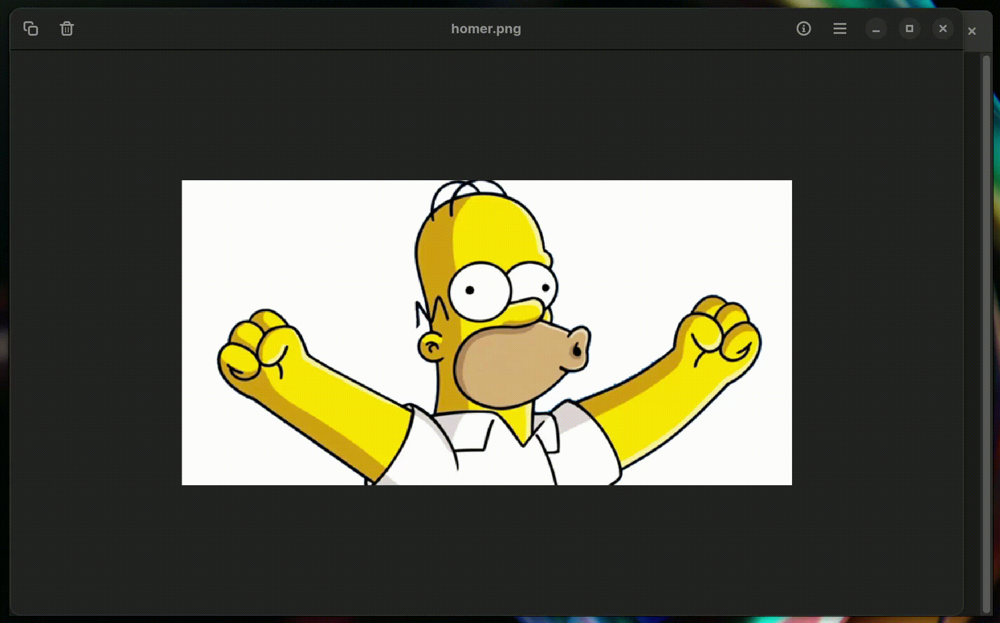

# Ascold

Convert pictures to ASCII art.

```shell
./ascold <path-to-picture>
```



### Build

```shell
$ cd ascold
$ dotnet publish
```

Ascold uses the [SkiaSharp](https://github.com/mono/SkiaSharp) library for image processing. By default, native libraries are compiled into the executable.

The build generates a standalone executable, which can be transferred to a directory included in your `PATH` variable for use. The standard path for build output is `Ascold/bin/Release/net8.0/<runtime-identifier>/publish`.

### Bugs (TODO)

* Wrong brightness for transparent backgrounds.

### Mentions

* https://www.jonathan-petitcolas.com/2017/12/28/converting-image-to-ascii-art.html &mdash; this article by Jonathan Petitcolas served as an inspiration and the main source of information for the project. 
