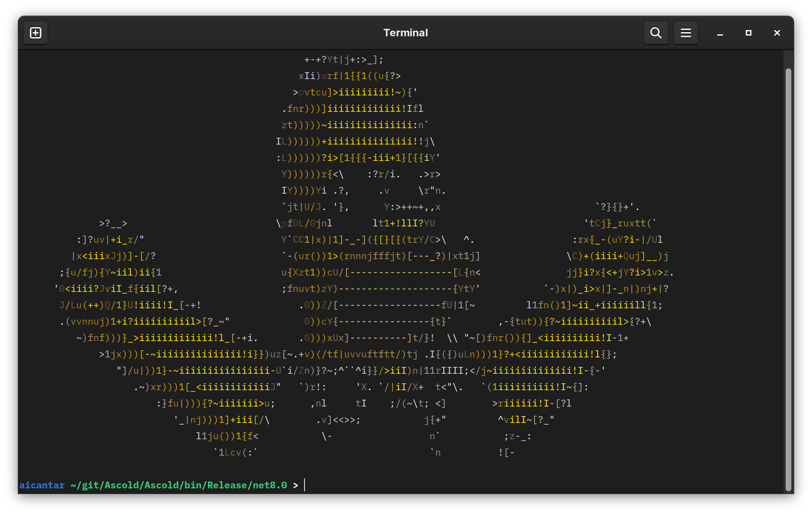

# Ascold

Convert pictures to ASCII art.

### Usage

```shell
./Ascold <path-to-picture>
```

### Demo




### Mentions

This article by Jonathan Petitcolas served as an inspiration and source of information for the project: https://www.jonathan-petitcolas.com/2017/12/28/converting-image-to-ascii-art.html 
